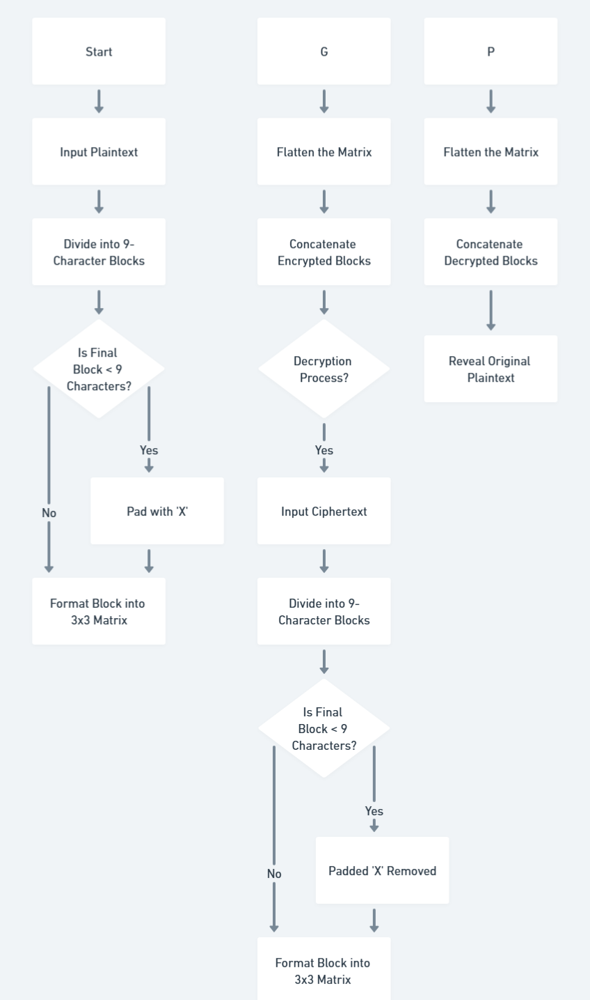

<div align="center">

# 🔐 **Assignment Title**  
## **Cipher Cube Chaos: Rubik’s Twist on Encryption**

---

### **Course Information**  
 **Course Title:** Mathematical Analysis for Computer Science  
**Course Code:** CSE 361  

---

### **Submitted by**  
**Name:** Md. Samaun Islam  
 **Student ID:** 2102026<br>
 **Department:** Computer Science and Engineering  
 **University:** Hajee Mohammad Danesh Science and Technology University    

---

### **Submitted to**  
 **Name:** Pankaj Bhowmik  
 **Designation:** Lecturer  
 **Department:** Computer Science and Engineering  
 **University:** Hajee Mohammad Danesh Science and Technology University  

</div>

---

## 1. Algorithm Overview

**Cipher Name:** Rubik's Cipher  
**Type:** 3D Transposition Cipher  
**Inspired by:** Rubik’s Cube rotation mechanics  

### Key Features
- **Symmetric Key:** Same key for encryption and decryption  
- **Block Size:** 3×3 (9 characters per block)  
- **Key Moves:** Spatial operations — R (Right), L (Left), U (Up), D (Down)  
- **Reversible:** Decryption is the inverse of encryption  
- **Flexible Input:** Handles any length, processes in blocks  

---

## 2. Algorithm Design

### Encryption Steps
1. **Divide** plaintext into 9-character blocks.  
2. **Pad** the last block with `'X'` if needed.  
3. **For each block:**
    - Arrange as a **3×3 matrix**.
    - Apply each **key move** in order:
      - `R`: Rotate right column **down**
      - `L`: Rotate left column **up**
      - `U`: Rotate top row **right**
      - `D`: Rotate bottom row **left**
4. **Flatten** the matrix and concatenate blocks for ciphertext.

### Decryption Steps
1. **Divide** ciphertext into 9-character blocks.  
2. **For each block:**
    - Rebuild the **3×3 matrix**.
    - Apply **reverse key moves** in **reverse order**:
      - `R`: Rotate right column **up**
      - `L`: Rotate left column **down**
      - `U`: Rotate top row **left**
      - `D`: Rotate bottom row **right**
3. **Flatten** and concatenate all blocks.
4. **Remove padding** (`X`) to recover original text.

---

## 3. Example Test Case

**Plaintext:** `SECRET`  
**Key Moves:** `["R", "U"]`

### Encryption Walkthrough

1. **Padded Plaintext:**  
    `SECRETXXX`

2. **Initial Matrix:**

| S | E | C |
|---|---|---|
| R | E | T |
| X | X | X |

3. **After 'R' (Right column down):**

| S | E | X |
|---|---|---|
| R | E | C |
| X | X | T |

4. **After 'U' (Top row right):**

| X | S | E |
|---|---|---|
| R | E | C |
| X | X | T |

**Final Ciphertext:** `XSERECXXT`

### Decryption
Apply `["U", "R"]` in reverse order to recover: `SECRET`

---

## 4. Python Implementation

```python
def rubik_encrypt(plaintext, moves):
     blocks = [plaintext[i:i+9] for i in range(0, len(plaintext), 9)]
     result = ""
     for block in blocks:
          padded = block.ljust(9, 'X')
          cube = [list(padded[i:i+3]) for i in range(0, 9, 3)]
          for move in moves:
                if move == 'R':
                     cube[0][2], cube[1][2], cube[2][2] = cube[2][2], cube[0][2], cube[1][2]
                elif move == 'L':
                     cube[0][0], cube[1][0], cube[2][0] = cube[1][0], cube[2][0], cube[0][0]
                elif move == 'U':
                     cube[0][0], cube[0][1], cube[0][2] = cube[0][2], cube[0][0], cube[0][1]
                elif move == 'D':
                     cube[2][0], cube[2][1], cube[2][2] = cube[2][1], cube[2][2], cube[2][0]
          result += ''.join([''.join(row) for row in cube])
     return result

def rubik_decrypt(ciphertext, moves):
     blocks = [ciphertext[i:i+9] for i in range(0, len(ciphertext), 9)]
     result = ""
     for block in blocks:
          cube = [list(block[i:i+3]) for i in range(0, 9, 3)]
          for move in reversed(moves):
                if move == 'R':
                     cube[0][2], cube[1][2], cube[2][2] = cube[1][2], cube[2][2], cube[0][2]
                elif move == 'L':
                     cube[0][0], cube[1][0], cube[2][0] = cube[2][0], cube[0][0], cube[1][0]
                elif move == 'U':
                     cube[0][0], cube[0][1], cube[0][2] = cube[0][1], cube[0][2], cube[0][0]
                elif move == 'D':
                     cube[2][0], cube[2][1], cube[2][2] = cube[2][2], cube[2][0], cube[2][1]
          result += ''.join([''.join(row) for row in cube])
     return result.rstrip('X')
```

---

## 5. Flowchart

  

---

## 6. Security Analysis

**Strengths:**
- **Rotation Complexity:** Spatial moves are non-trivial to reverse without the key.
- **Simplicity:** Easy to implement and understand.
- **Reversibility:** Same logic for both encryption and decryption.

**Weaknesses:**
- **Fixed Block Size:** Only 9 characters per block.
- **Predictable Padding:** Constant `'X'` padding could be exploited.
- **Limited Keyspace:** Short move sequences (e.g., `["R", "U"]`) are easy to brute-force.

---

## 7. Conclusion

Rubik’s Cipher is a visually intuitive, educational cipher that demonstrates spatial transposition. While not suitable for real-world secure communication, it is an excellent tool for exploring:

- Symmetric cryptography concepts
- Key reversal and block operations
- Trade-offs between simplicity and cryptographic strength

